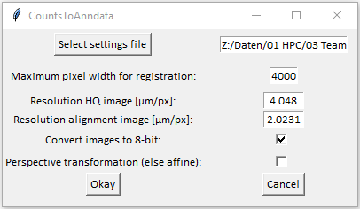

# CountsToAnndata

This workflow shows how to create a anndata file from the raw count matrix which was created in `ReadsToCounts`.

It involves the following steps:
  1. Alignment of transcriptome spots using alignment image.
  2. Addition of experimental parameters to dataset.
  3. (Optional) Registration of hiqh-quality images with alignment image using SIFT algorithm.

*CountsToAnndata* has been tested on Windows and Linux.

# Get started
## Installation of environment

```
# create environment
conda env create -f CountsToAnndata.yml

# activate environment
conda activate CountsToAnndata
```

## Settings files structure

An example settings file can be found in `./CountsToAnndata_params.csv`

It consists of one `.csv` file with two parts
### 1. parameters

| >parameters | category                   | value                    |   | >help                                                                                                                 |
|-------------|----------------------------|--------------------------|---|-----------------------------------------------------------------------------------------------------------------------|
|             | n_channels                 | 38                       |   | `n_channels`: number of channels on the xDbit chip                                                                    |
|             | spot_width                 | 50                       |   | `spot_width`: width of the channels/pixels in µm                                                                      |
|             | frame                      | 100                      |   | `frame`: width in µm of the frame that is left around the dataset.                                                    |
|             | align_images:align_channel | C01                      |   | `align_images:align_channel`: string pattern for files containing the   images of the alignment channel.              |
|             | align_images:dapi_channel  | C03                      |   | `align_images:dapi_channel`: string pattern for files containing the   images of the DAPI channel.                    |
|             | hq_images:channel_names    | C00 C01 C02 C03          |   | `hq_images:channel_names`: space-separated list of string patterns for   files containing a channel of the hq images. |
|             | hq_images:channel_labels   | bf align phalloidin dapi |   | `hq_images:channel_labels`: space-separated list of names for the   channels of the hq images.                        |
|             |                            |                          |   | `organism` needs to fit into gprofiler naming convention, e.g. mmusculus   or hsapiens                                |

### 2. directories

| >directories | experiment_id | unique_id | organism  | main_dir                                                             | input_transcriptome                                              | align_images                                           | hq_images                                           | output_dir   | vertices_x | vertices_y | age   | organ  |   |   |   |
|--------------|---------------|-----------|-----------|----------------------------------------------------------------------|------------------------------------------------------------------|--------------------------------------------------------|-----------------------------------------------------|--------------|------------|------------|-------|--------|---|---|---|
|              | 37_30         | A1        | mmusculus | Z:\Daten\01 HPC\03 Team Meier\08_Projects\37_Spatial_Barcoding\37_30 | data\raw_matrices\wells\A1\DGE_matrix_with_introns_min100.txt.gz | data\alignimages\37_30_10X_13x10_20%\B=0\Stitched\S=6* | data\hdimages\37_30_10X_13x10_20%\B=0\Stitched\S=6* | data\anndata |            |            | young | kidney |   |   |   |
|              | 37_30         | A2        | mmusculus | Z:\Daten\01 HPC\03 Team Meier\08_Projects\37_Spatial_Barcoding\37_30 | data\raw_matrices\wells\A2\DGE_matrix_with_introns_min100.txt.gz | data\alignimages\37_30_10X_13x10_20%\B=0\Stitched\S=7* | data\hdimages\37_30_10X_13x10_20%\B=0\Stitched\S=7* | data\anndata |            |            | young | kidney |   |   |   |
|              | 37_30         | A3        | mmusculus | Z:\Daten\01 HPC\03 Team Meier\08_Projects\37_Spatial_Barcoding\37_30 | data\raw_matrices\wells\A3\DGE_matrix_with_introns_min100.txt.gz | data\alignimages\37_30_10X_13x10_20%\B=0\Stitched\S=8* | data\hdimages\37_30_10X_13x10_20%\B=0\Stitched\S=8* | data\anndata |            |            | young | brain  |   |   |   |

## Run pipeline

```
python `./CountsToAnndata.py`
```

### Input window

The pipeline invokes following input window: 


If the window cannot be opened, all inputs can be entered in the input prompt.

### Alignment marker selection and image registration.

To align spatial transcriptome and image data, alignment markers were introduced in xDbit. The selection of the vertices of those markers is done semi-automatically and requires some manual selection. The *CountsToAnndata* pipeline invokes a *napari* window, in which you can mark the vertices with points using the tool box provided by *napari*. The selection can be done as described in following example:


After doing the marker selection for all datasets provided in the settings file, the pipeline saves a settings file with coordinates of the vertices added to the columns `vertices_x` and `vertices_y`.

If HQ images are given to the pipeline in the column `hq_images` of the settings file, the pipeline uses the SIFT algorithm (https://doi.org/10.1023/B:VISI.0000029664.99615.94) to register alignment image and HQ image based on the dapi channel. 

### Output

The output is saved into the directory selected in the `output_dir` column in the settings file.

Following output directories and files are created by the pipeline:

1. `{id}_hqimages.h5ad`: Main output file with registered HQ image data.
2. `{id}_check_registration.png`: Image of a zoomed-in region of the xDbit data aligned to the alignment image and the hq image to check the success of the image registration process.
3. `{id}_matchedVis.png`: Image showing the results of the SIFT algorithm.
4. `tmp/`: Folder with `{id}_alignimages.h5ad` files which contain the xDbit data with the alignment images instead of the hq images. These files can be used in case the registration of the HQ files failed.

