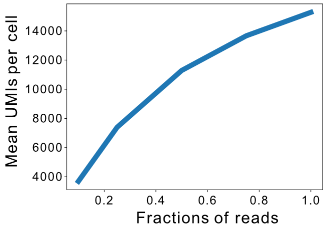

# Subsampling analysis to analyze saturation of sequencing run

To analyze the saturation of sequencing runs we randomly subsampled the sequencing reads before the generation of the gene expression matrix. For this the scripts in this directory were used. The pipeline can be started using the script `subsample_run_batch.py` and a parameters file (an exemplary file `subsampling_parameters.csv` is provided). The pipeline has been tested on a Linux system.

## Parameters file

- `name`: Specifies which prefix is added to the files of the final plots.
- `batch`: The pipeline can be run on multiple cores in parallel. This parameter specifies which of the files are run together, i.e. in which batch they are run.
- `file`: Path to the gene tagged bam file. In the xDbit pipeline it has the name `gene_function_tagged.bam`.

## Run analysis
```
# activate the ReadsToCounts environment
conda activate ReadsToCounts

# start run
nohup python </path/to/>subsample_run_batch.py -f </path/to/>subsampling_parameters.csv &
```

Depending on the size of the samples the analysis can take several hours.

## Example of results


